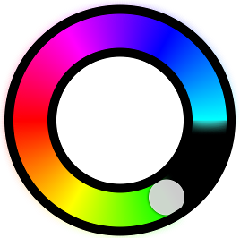

# CircularSlider

iOS circular slider demo project

Based on slightly modified [TB_CircularSlider](https://github.com/ariok/TB_CircularSlider) and [this s/o thread](http://stackoverflow.com/questions/11783114/draw-outer-half-circle-with-gradient-using-core-graphics-in-ios)
 
Features various gradient types on circular slider

  
